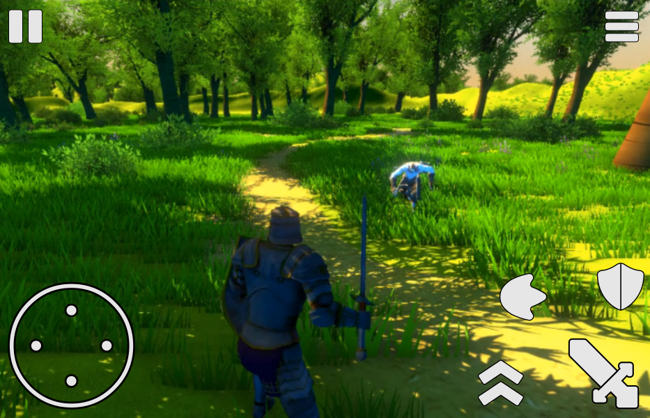

# Diseño iterativo

Es un proceso común en el flujo de trabajo del diseño de IUs. Lo estaremos usando como parte de nuestro proceso de maquetado para encontrar cualquier mejora o adiciones que podamos realizar.

El diseño iterativo es el proceso de prueba de una interfaz, realizando cambios basados en dicha prueba y repitiendo el proceso para refinar el producto. A esto se le conoce como un proceso circular que en sí, no tiene un fin específico, más bien lo estaremos repitiendo hasta quedar satisfechos con el resultado.

```{mermaid}
flowchart LR
    A(Probar la interfaz) --> B(Identificar problemas y obtener retroalimentación)
    B --> C(Refinar y mejorar la interfaz)
    C --> A
```

Al ser un esqueleto o boceto no funcional, tendremos que ingeniar maneras de simularlo. Puede ser algo tan simple como imprimir la maqueta y sobreponerla en un teléfono y realizar las pruebas con usuarios potenciales, por ejemplo.

## Primer iteración

Algo que podemos notar es que la palanca debe ser muy notoria, ya que es importante. Sin embargo, no pasa lo mismo con las acciones. No le comunicamos al jugador cuál es el botón más importante. Podemos lograrlo si volvemos más grande al que más utilizará: el ataque. Aquí simulamos ser el jugador, notamos que necesita ser más visible el ataque, lo agrandamos para lograrlo. Listo, ya resolvimos un inconveniente.



## Segunda iteración

Podemos pasar a una segunda fase de pruebas en la que, como jugador, nos damos cuenta que no tenemos manera alguna de saber la salud de nuestro personaje. Hay que darle esa información al jugador. Procedemos a dirigirnos a Inkscape de nuevo.

A mano izquierda se encuentran las herramientas. Buscamos la que se llama *Rectángulo* o presionamos simplemente . Podemos ya insertar una forma que retoma nuestros ajustes de color de relleno y borde, por lo que hará buen juego de entrada con los demás iconos. Lo alineamos al eje central así solo y lo hará con el lienzo. Ahora le daremos un poco de redondeo. Le damos clic derecho y luego *Propiedades del objeto*. A la derecha aparecerá otro panel, ahí modificamos su tamaño a `200` por `13`, por ejemplo o a nuestro gusto y luego cambiamos su radio a `2` tanto en *x* como en *y*. Lo volvemos a alinear si fuera necesario.

Como la barra de vida no es algo funcional, solo visual, para reflejar los cambios en la salud, agregamos otro rectángulo sobre el anterior pero a este le editamos el tamaño para que sea más corto, lo alineamos a su izquierda y le cambiamos el color de relleno a rojo. También hacemos que empate el radio y quizá deseemos quitarle el color de borde.

Y ya que estamos, incluimos texto que muestre cuantitativamente la salud restante. A la izquierda está la herramienta *Texto* o presionamos  y damos clic aproximadamente donde queramos el texto. Ponemos 75/100, por ejemplo y damos clic derecho para escoger *Texto y tipografía*. Ahí en el panel cambiamos la fuente, el tamaño y el texto, mientras el color lo elegimos de la paleta inferior.


Listo, hemos cubierto una segunda prueba y resuelto lo encontrado en ella. De esto se trata el diseño iterativo. ¿Qué podríamos encontrar en una tercera iteración?

## Tercera iteración

Pues bien, parece que sí se necesita otra mejora que una tercera iteración podría descubrir: la barra de vida de los enemigos. Fácil, en Inkscape simplemente seleccionamos los dos rectángulos que la conforman, los copiamos y los pegamos encima del enemigo que se ve en la pantalla. Lo redimensionamos y listo. Tercer lío resuelto.


